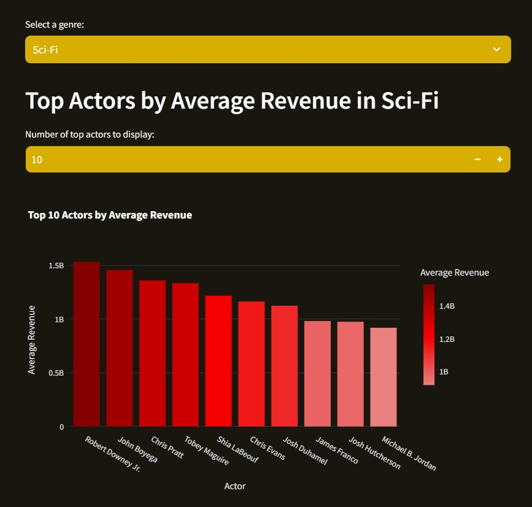
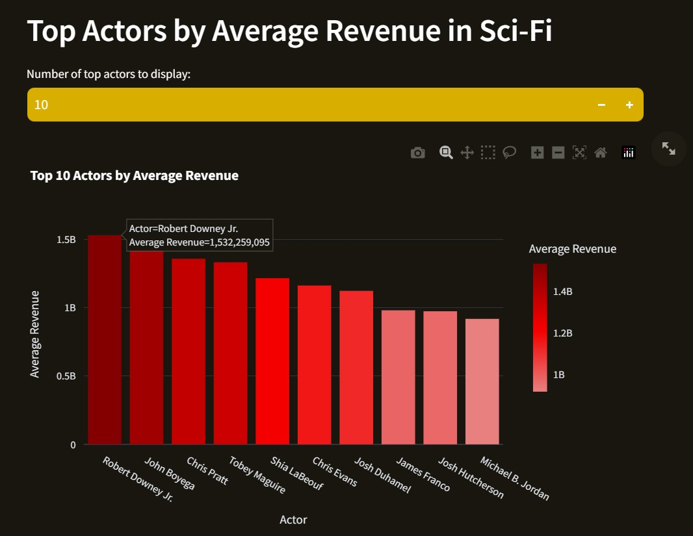
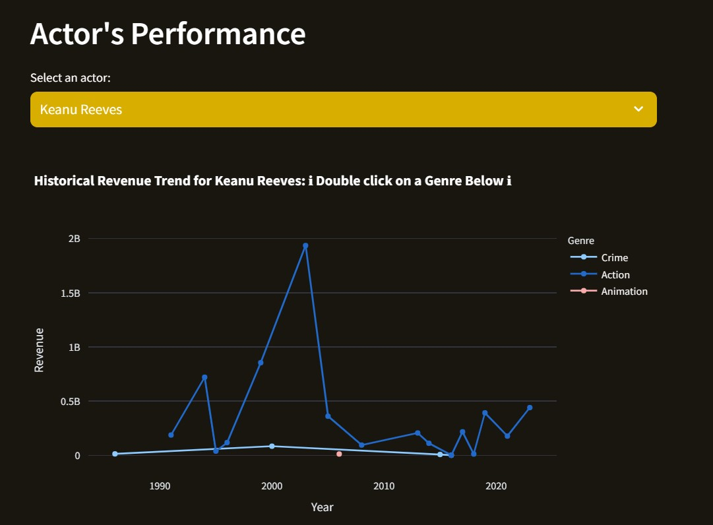
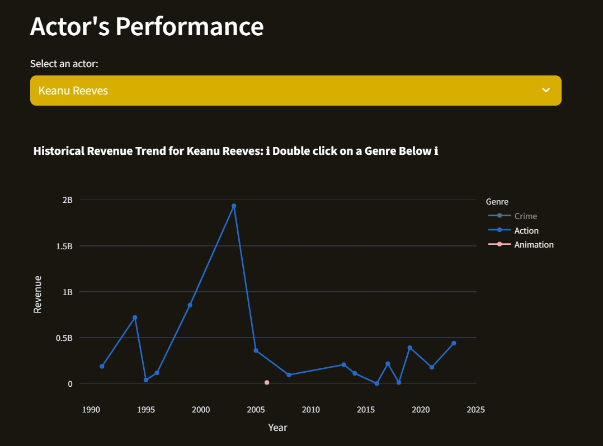
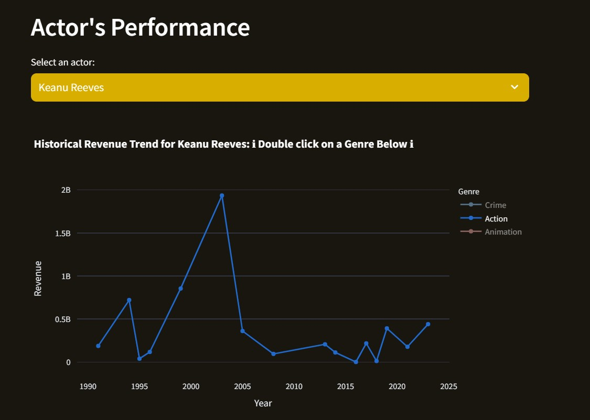
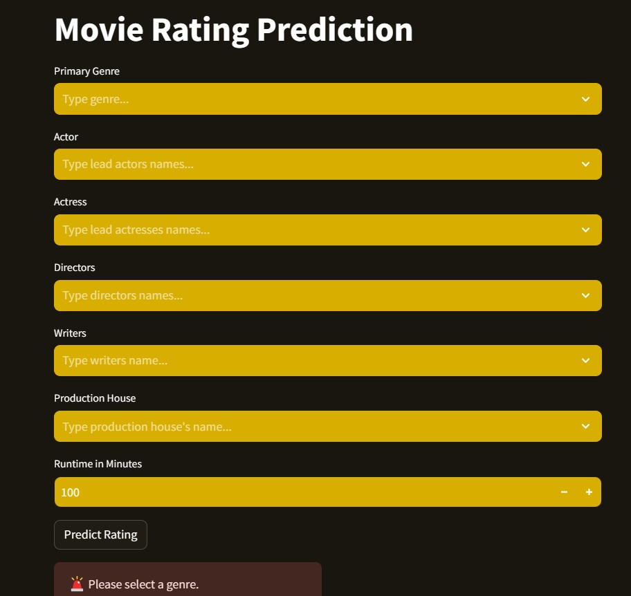
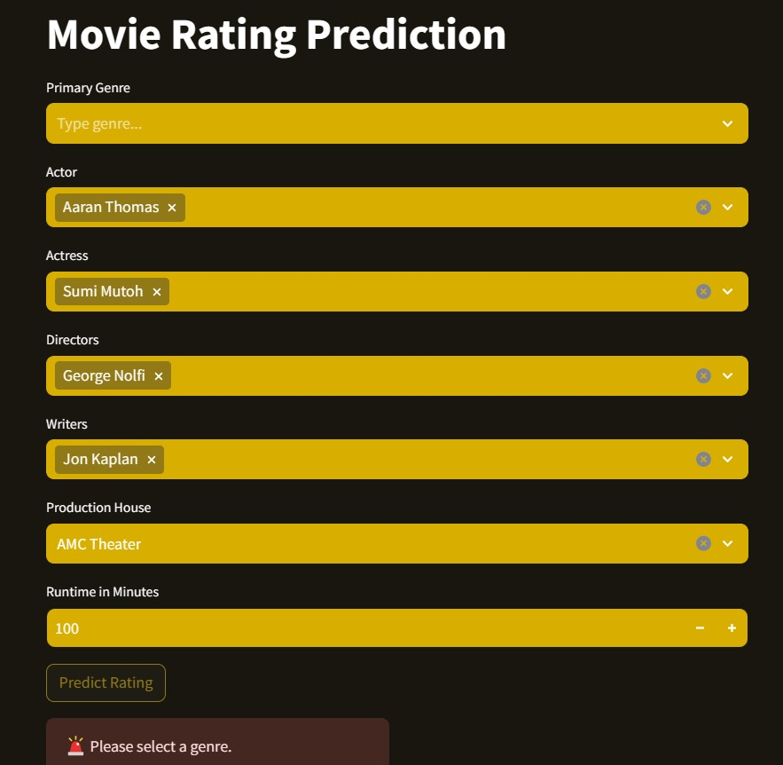
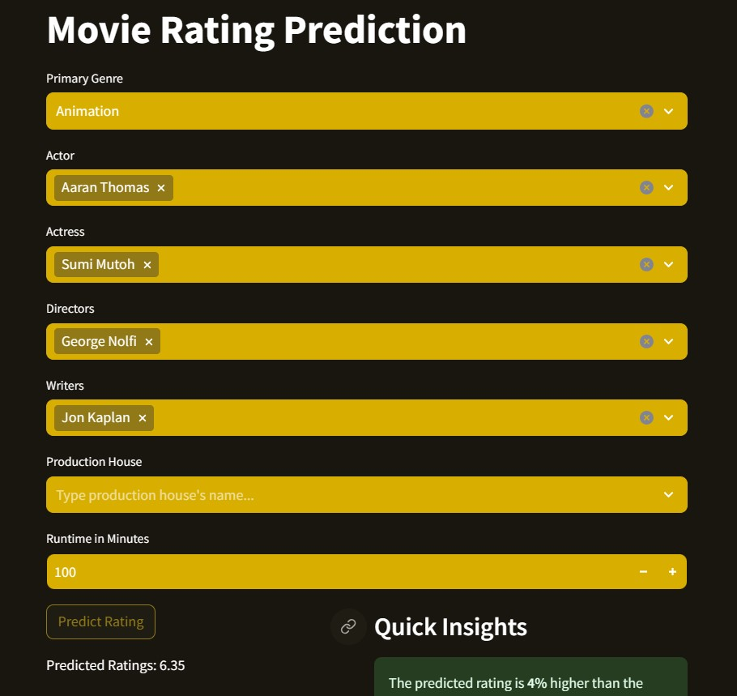
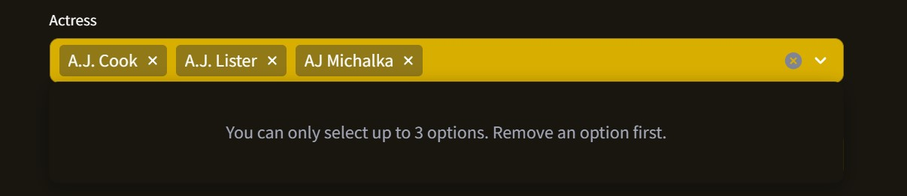
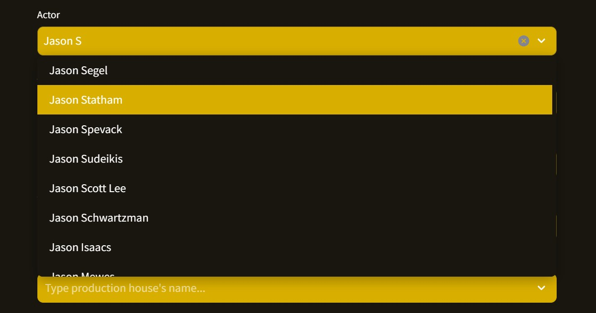

# Examples

## Running our Tests

Copy the test_app.py file and in the terminal "python " + copied file path. You should see that 58 tests pass.

## Home Page

Begin by reading the "Tutorial For Using the Tool" section in the README file. Open terminal and let's get started!

## Movie Analytics Dashboard

Navigate to this tab by clicking it, there are two sub tabs: "Actors" and "Actresses", select the one you desire.

Select a genre(which is set to "Action" by default) by scrolling along the drop down menu or entering letters to reduce filtering options, and then select the amount of top actors you want to display, the title and graph will change accordingly.

Here is an example when you select "Sci-Fi" and display top 10 actors:

You can also hover on to the bars to see the actor name and the average revenue.

In the next section, you can select an actor(which is set to the highest revenue actor in that genre by default), and the graph will present the historical revenue trend of that actor in a multi line chart, with every single line represents one genre.

Single click on a genre will hide it.

Double clicking will hide all the rest genres.

If you input an actor's name and didn't see any results in the drop down menu, it could be either that actor is not in the database, or there is a spelling error in your input.

The "Actresses" subtab also share similar behavior.

## IMDb Movie Ratings Predictor and Box Office Revenue Predictor

These two tabs share similar behavior, so we will go through them together, using the "IMDb Movie Ratings Predictor" tab as example.

There are seven input boxes: "Primary Genre", "Actor", "Actress", "Directors", "Writers", "Production House" and "Runtime in Minutes". Unlike what you've seen in the "Movie Analytics Dashboard" tab, only the box below "Runtime in Minutes" has a default input of 150.

You can pick one Genre and one Production House, and up to three for the rest four(Actor, Actress, Directors and Writers).

After you have the desired inputs for all boxes, click the "Predict Rating" button to view the predicted rating.

For example, I selected "Biography" as the primary genre, "50 Cent" as the actor, "AJ Michalka" as the actress, "Aanand L. Rai" as the director, and "A.E. Hotchner" as the writer, and here is the result:

As you can see on the right side, not only did the tool provide you with the predicted rating value, it also provided some analysis. Try to change the input values and we hopd you can find more insights when using it.

### But what if I don't select a genre??

Simple. A "Please select a genre" alert message will raise.

And this is also the case even if you have filled up the rest boxes.

But this is not the case if you fill up every boxes but leaving out the "Production House" box.

You can explore other cases by your own. In fact, as long as there is an input in the "Primary Genre" box and all the inputs are within the given range, it will yield results when you click the "Predict Rating" button. But of course, if you want more precise estimation, you need to have more inputs.

I said "within the given range", since you can't proceed if, for example, your input of runtime in the "Runtime in Minutes" box exceeds 300.

And as aforementioned, you can only select up to three options for the "Actor", "Actress", "Directors", and "Writers" boxes. When you select 3, the app will prompt you "You can only select up to 3 options. Remove an option first." You can still navigate to another box and fill it up, while keep the selected 3 in the box you left.

### But what if I don't remember an input name or I don't know the name??

No worries. As you are navigating through the tabs, you may have already noticed you can enter some input into the most of the boxes and the drop down menu will be filtered according to your input. If for example, you don't remember an actor's full name, you may still be able to locate him.

We hope you enjoy this tool!