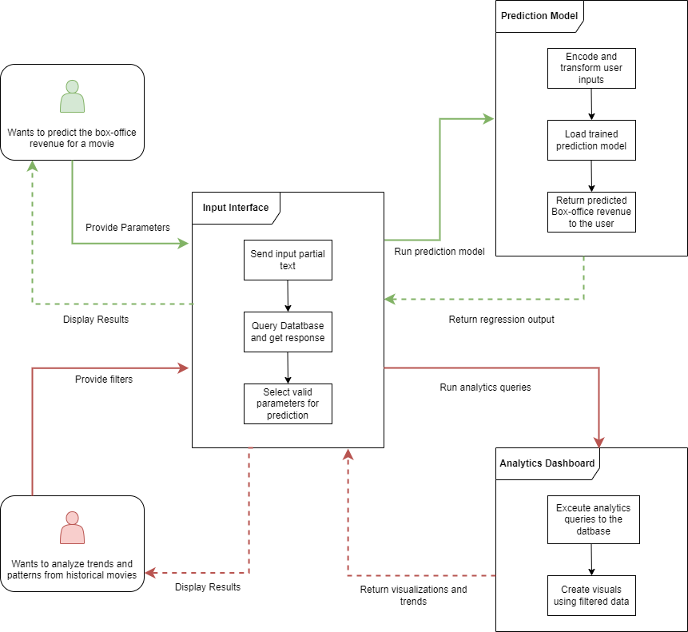

# Component Specifications

## Component 1: Movie Data Input Interface
- Name: movieDataInput
- What it does:
  - Provides a user interface for inputting hypothetical movie scenarios, including cast, crew, genre, and other production details.
- Inputs:
  - cast_configuration (List): List of actors' names.
  - crew_configuration (List): List of crew members and their positions.
  - genre (String): The genre of the hypothetical movie.
  - production_details (Dictionary): A dictionary containing key production details such as budget, runtime??.
- Outputs (with type information):
  - input_success (Boolean): True if the data input is successful, False if there is an error.
- Assumptions:
  - User has all necessary information about the hypothetical movie.
  - All input data is validated for format and completeness.

## Component 2: Box Office Prediction Model Interface
- Name: boxOfficePredictor
- What it does:
  - Train a machine learning model to predict potential box office earnings based on input data.
- Inputs:
  - movie_features (Vector): A multi-dimensinal array of  normlaized and encoded features extracted from user input relevant to the ML model.
- Outputs:
  - predicted_revenue (Float): The predicted box office revenue.
  - confidence_interval (Tuple of Floats): A tuple representing the lower and upper bounds of the predicted revenue confidence interval.
- Assumptions:
  - The machine learning model is trained with no significant overfitting and bias and is able to perform well on new unseen movies
  - The tabular data of the inputs fits well within the parameters of the XGBoost model as suggested

## Component 3: Historical Data Analysis Dashboard
- Name: historicalDataAnalyzer
- What it does:
  - Analyzes historical data to show trends and insights relevant to the user’s query.
- Inputs:
  - query_parameters (Dictionary): A dictionary with keys such as 'genre', 'cast', 'crew', 'time_period'.
- Outputs (with type information):
  - trends_report (String): A statistical summary of insights.
  - visual_charts : Graphical representations of trends (e.g., bar charts, line graphs).
- Assumptions:
  - None

# Sequence Diagrams

## Overall Component Interaction diagram for use-cases

## Movie Data Input Interface Sequence Diagram

## Analytics Dashboard Sequence Diagram

